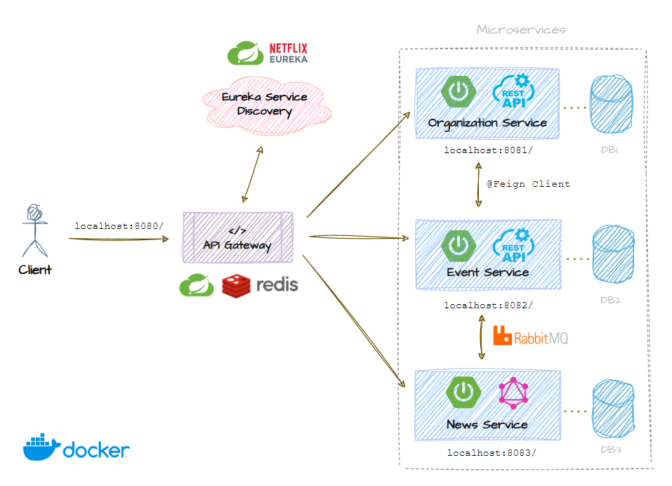

# 🍃 Spring Microservices

This project demonstrates a microservices architecture with the following components:

- `api-gateway`: Central entry point using **Spring Cloud**, supports dynamic routing and load balancing
- `eureka-server`: Service registry and discovery using **Netflix Eureka**
- `organization-service`: Manages organizations, exposes REST endpoints, and is called via **FeignClient**
- `event-service`: Manages events, communicates asynchronously via **RabbitMQ**
- `news-service`: Consumes event messages and exposes a **GraphQL** API for querying news



## 🛠 Prerequisites

- Java 17+
- Docker & Docker Compose

## 🚀 How to run

1. Clone this repo

2. Build JARs using the provided script:

- On Windows: `build.bat`

- On Linux/macOS: `build.sh`

3. Start all services using Docker Compose:

```
docker-compose up --build

```

4. Access the services:

| Service            | URL                                 |
| ------------------ | ----------------------------------- |
| Eureka Dashboard   | http://localhost:8761               |
| API Gateway        | http://localhost:8080               |
| RabbitMQ UI        | http://localhost:15672              |
| GraphQL Playground | http://localhost:8080/news/graphiql |

## 🔁 Flow Overview

1. All services register themselves with **Eureka**.

2. `event-service` uses **FeignClient** to communicate with `organization-service` by service name.

3. When an event is created, a message is sent to **RabbitMQ**.

4. `news-service` listens for incoming messages and creates a related news entry.

5. External requests go through the **API Gateway**, which handles routing and load balancing.

## 📄 License

This project is available as open source under the terms of the [MIT License](http://opensource.org/licenses/MIT).
